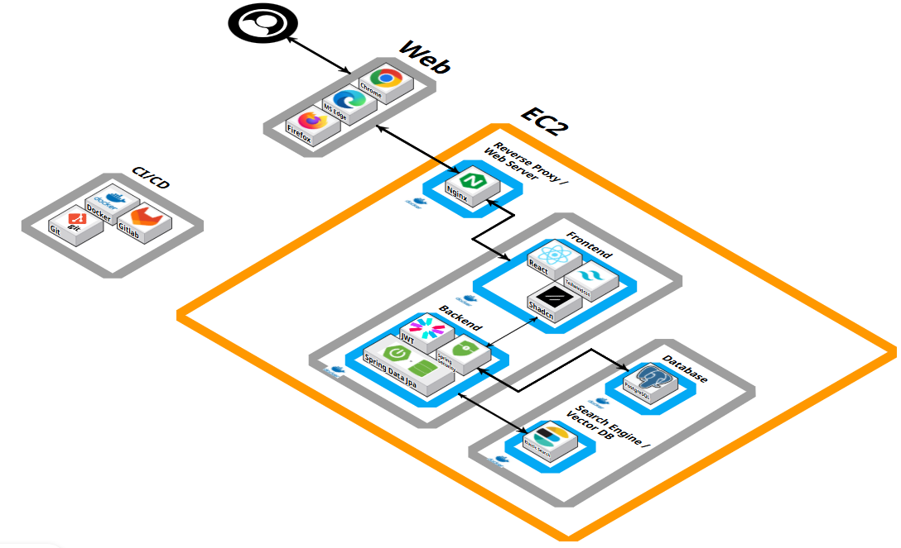
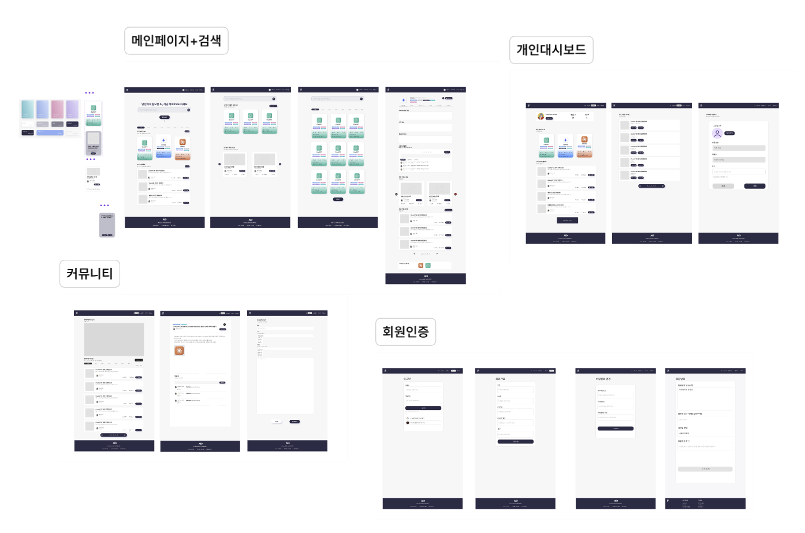

# Source Code Link
https://github.com/LWH4Data/PJT_01_AID_src

# 🤖 AI 종합 정보 플랫폼 - AI:D

> "모두가 쓰는 AI, AI:D에서 찾아보세요!"<br/>
> AI 서비스의 발견과 활용을 이어주는 종합 정보 플랫폼입니다

<br/>

## 🗂️ 프로젝트 개요

- **AI 종합 정보 플랫폼- AI:D** 는 AI에 관심이 있지만 무엇을 어떻게 써야하는지 막막한 초보 사용자들을 위해, 다양한 AI 서비스의 핵심 정보와 활용 방법을  한 곳에서 제공하는 통합 플랫폼입니다.
- LLM을 기반으로 기존 키워드 중심 검색의 한계를 보완하여, 자연어 의미 기반 검색 기능을 지원합니다. 또한, 카드형 UI를 활용해 단순한 텍스트 나열이 아닌 시각적으로 이해하기 쉬운 정보 제공을 목표로 합니다.

### 📅 프로젝트 정보

- 개발 기간: 2025.07.14~2025.08.18 (5주)
- 프로젝트 목표: 다양한 AI 서비스 정보를 통합하고 의미 기반 검색을 통해 초보 사용자도 쉽게 활용할 수 있는 **AI 정보 플랫폼 구축**


### 👥 팀원 소개

|  |  |  |  |  |  |
|:---:|:---:|:---:|:---:|:---:|:---:|
| **이웅희(팀장)** | **최수빈** | **박수아** | **안다빈** | **조은경** | **김규빈** |
| Infra | Frontend | Frontend | Frontend / PM | Backend / AI | Backend |

<br/>

## 💡 서비스 특징

### 기획 배경
- AI:D는 AI 종합 정보 플랫폼으로 급격히 변화하는 AI 환경에서 다음과 같은 문제를 해결하기 위해 기획되었습니다.
    - **정보 과잉**: 매일 수십 개의 AI 툴이 출시되지만 정보가 분산되어 접근성이 낮음
    - **인지 편중**: ChatGPT 외 다양한 AI 툴과 특화 기능에 대한 인식 부족
    - **활용 미비**: 동일한 툴도 활용 방법에 따라 결과가 달라지지만 가이드가 부족함

### 타겟 유저
- **AI 입문자**: AI에 관심은 있지만 어떤 툴을 어떻게 활용해야 할지 모르는 사용자
- **실무형 초급 사용자**: ChatGPT 등 일부 서비스만 경험해봤고, 다른 AI 툴 정보나 활용법을 찾는 데 어려움을 겪는 사용자
- **정보 탐색에 어려움을 느끼는 일반 사용자**: 흩어진 정보와 빠른 업데이트 속도로 인해 필요한 정보를 한눈에 정리해 보고 싶은 사용자

### 주요 기능 
**🔍 AI 서비스 검색**
- **자연어 의미 검색**: LLM 기반으로 사용자의 질의를 분석하여 관련 AI 서비스 카드와 활용 영상 제공

**🗂️ AI 정보 서비스**
- **AI 카드 전체 목록**: 카테고리별 AI 서비스 정보 브라우징
- **상세 정보 페이지**: AI 주요 기능, 장단점, 사용자 한줄평, 관련 영상 등 종합 정보 제공

**💬 커뮤니티 서비스**
- **게시판**: 사용자 간 AI 활용법 공유 및 토론
- **버블 차트**: 게시글 현황 시각화 제공
- **댓글 시스템**: 게시글 댓글·대댓글 작성 및 관리 기능

**👤 개인화 서비스**
- **마이페이지** : 관심 AI 카드 및 커뮤니티 게시글 스크랩/관리
- **회원 인증**: 회원가입,로그인,로그아웃 지원
- **프로필 관리**: 사용자가 작성한 게시글 및 활동 내역 확인

<br/>

## 🛠️ 개발 환경 & 기술 스택
### Backend
    - Language: Java
    - Framework: Spring Boot 3.5.4
    - ORM: JPA (Hibernate)
    - Database: PostgreSQL 16 (pgvector extension)
    - Security: Spring Security, JWT
    - Build Tool: Gradle
### Frontend
    - Language: TypeScript, JavaScript
    - Framework: Next.js 15.4.3 (Latest)
    - Runtime: Node.js v22.17.1 (LTS)
    - Package Manager: pnpm
    - Library: React 19.1.0, react-dom 19.1.0
    - Styling: Tailwind CSS, shadcn/ui
### Data/AI
    - Language: Python
    - Crawling: Selenium, Requests
    - Data Handling: Pandas, NumPy, scikit-learn
    - Search Engine: Elasticsearch 8.12.2 (BM25, kNN Search, HNSW)
    - Embedding: Upstage Solar Embedding API
    - AI Model: Upstage Solar Pro2 (LLM)
    - Vector Search: PostgreSQL pgvector
### DevOps:
    - Containerization: Docker, Docker Compose
    - Web Server: NGINX
    - Deployment: AWS EC2
### Communication
    - Verson control: Git(GitLab)
    - UI/UX Design: Figma
    - Project Management: Notino, Jira

<br/>

## ⚙️ 시스템 아키텍처 



<br/>

## 🗃️ ERD
[AI:D ERD](https://www.erdcloud.com/d/BzeobttQvGNk6nM9G)


<br/>

## 🖌️ UI/UX

[AI:D 와이어프레임](https://www.figma.com/design/E2FfGhVLjimSyKnCU54VaS/Ai%ED%81%90%EB%A0%88%EC%9D%B4%EC%85%98?node-id=116-2459&t=VUwW5ljZDHj3La9s-1)



<br/>

## 🗂️ 디렉토리 구조
<details> 
<summary>Backend</summary>    

```bash
    backend/
    └── src/
        └── main/
            └── java/com/lux/backend/
                ├── domain/                     # 도메인별 모듈 구조
                │   ├── aitool/                 # AI 툴 관련
                │   │   ├── controller/         # REST API 컨트롤러
                │   │   ├── converter/          # Entity-DTO 변환
                │   │   ├── dto/                # 데이터 전송 객체
                │   │   ├── entity/             # JPA 엔티티 클래스
                │   │   ├── projection/         # Projection 인터페이스
                │   │   ├── repository/         # DB 접근 계층
                │   │   └── service/            # 비즈니스 로직
                │   │
                │   ├── auth/                   # 인증/인가 모듈
                │   │   ├── controller/
                │   │   ├── dto/
                │   │   ├── entity/
                │   │   ├── jwt/                # JWT 관련 유틸
                │   │   ├── repository/
                │   │   └── service/
                │   │
                │   ├── common/                 # 공통 모듈
                │   │   └── dto/
                │   │       ├── LikeToggleResponseDto.java
                │   │       ├── MetaDto.java
                │   │       └── ScrapToggleResponseDto.java
                │   │
                │   ├── searchengine/           # 검색 엔진 모듈
                │   │   ├── config/
                │   │   ├── controller/
                │   │   ├── dto/
                │   │   ├── embedding/
                │   │   ├── es/                 # Elasticsearch 연동
                │   │   ├── pca/                # PCA 차원 축소 모듈
                │   │   ├── repository/
                │   │   ├── rrf/                # Rank Fusion
                │   │   ├── service/
                │   │   └── util/
                │   │
                │   ├── community/              # 커뮤니티 모듈
                │   ├── dashboard/              # 대시보드 모듈
                │   ├── user/                   # 사용자 모듈
                │   └── youtube/                # 유튜브 관련 모듈
                │
                ├── global/                     # 전역 설정
                │   ├── config/                 # 전역 환경 설정
                │   ├── exception/              # 예외 처리
                │   └── util/                   # 공용 유틸
                │
                ├── BackendApplication.java     # Spring Boot 메인 실행 클래스
                └── package-info.java
```
</details>

<details> 
<summary>Frontend</summary>

```bash
    frontend/
    ├── .next/                  # Next.js 빌드 산출물
    ├── node_modules/           # 프로젝트 의존성 모듈
    ├── public/                 # 정적 리소스 (이미지, 아이콘 등)
    ├── src/                    # 소스 코드
    │   ├── app/                # Next.js App Router (페이지 라우팅)
    │   │   ├── ai/             # AI 관련 페이지
    │   │   ├── api/            # API 라우트 핸들러
    │   │   ├── change-password # 비밀번호 변경 페이지
    │   │   ├── community/      # 커뮤니티 관련 페이지
    │   │   ├── delete-account/ # 회원 탈퇴 페이지
    │   │   ├── login/          # 로그인 페이지
    │   │   ├── mypage/         # 마이페이지
    │   │   ├── search/         # 검색 페이지
    │   │   ├── signup/         # 회원가입 페이지
    │   │   ├── layout.tsx      # 전역 레이아웃
    │   │   └── page.tsx        # 기본 엔트리 페이지
    │   │
    │   ├── components/         # UI 컴포넌트 모음
    │   │   ├── atoms/          # 최소 단위 UI 요소
    │   │   ├── constants/      # 상수 정의
    │   │   ├── molecules/      # atoms 조합 단위
    │   │   ├── organisms/      # 복합 컴포넌트
    │   │   └── templates/      # 레이아웃/템플릿 단위
    │   │
    │   ├── ui/                 # 공용 UI 구성요소
    │   ├── context/            # React Context 관리
    │   ├── lib/                # 유틸 함수 및 라이브러리
    │   ├── styles/             # 전역 스타일 및 Tailwind 설정
    │   └── types/              # TypeScript 타입 정의
    │
    ├── middleware.ts           # Next.js 미들웨어 설정
```
</details>

<br/>

## 🪄 기능 상세 명세서 

### 🔎AI 검색


- 사용자는 자연어 그대로 검색어로 입력 가능 (예: 옛날 사진을 영상으로 만들기)
- **검색 핵심 로직**:
    - 키워드 기반 검색: BM25로 정확한 키워드 매칭 후, LLM이 질의를 Task 카테고리(1~3개)로 분류, 카테고리별 상위 결과를 균형 있게 반환
    - 의미 기반 검색: 질의를 벡터로 임베딩(1536차원)한 뒤, ElasticSearch의 HNSW + BM25 Rescore 방식으로 의미 기반 검색 수행

<hr/>

### 📂AI 정보 서비스

**전체 목록** 


- **인기 콘텐츠 확인**: 홈 화면에서 카테고리별 인기 AI TOP3 및 커뮤니티 인기 게시글 TOP3 제공
- **전체 목록 탐색**: “더보기” 버튼 클릭 시 전체 AI 카드 조회 가능
- **카드 UI기반 핵심 정보 제공**: AI 서비스의 핵심 정보(특징 태그, 가격, 출시일, 평점 등)를 직관적으로 표시하며, **Flip 모션**을 통해 상세 페이지로 연결

**상세 페이지** 


- **AI 상세 정보 제공**: 주요 기능, 공식 링크, 가격, 업데이트 내역, 유사 툴, 관련 영상 등 확인 가능
- **한줄평 작성**: 로그인 사용자는 평점과 함께 한줄평 작성 가능, 평점은 카드 정보에 반영

<hr/>

### 📝커뮤니티


- **게시글 목록**
    - 모든 게시글을 **좋아요 순**으로 정렬하여 표시
    - **버블 차트**를 통해 게시글 수 현황을 시각적으로 표현
    - 게시글 클릭 시 상세 페이지로 이동
- **게시글 상세 페이지**
    - 본문, 작성자, 작성일 등 상세 정보 확인 가능
    - **좋아요**: 로그인 사용자는 게시글에 좋아요 가능
    - **스크랩**: 게시글을 저장하여 마이페이지에서 관리 가능
    - **댓글/대댓글**: 로그인 사용자는 댓글 작성 및 삭제 가능(본인 작성 글만 삭제 가능)
- **게시글 작성 및 관리**


- 로그인 사용자는 새 게시글 작성 가능
- 작성자는 자신의 게시글을 수정 및 삭제 가능

<hr/>

### 👤 개인화 서비스


- **마이페이지 (로그인 필요)**
    - **사용자 정보**: 닉네임, 작성 게시글 수, 댓글 수 등 기본 정보 제공
    - **스크랩한 AI 목록**: 저장한 AI 카드 모음, 상세보기 버튼을 통해 상세 페이지로 이동
    - **스크랩한 게시글 목록**: 스크랩한 커뮤니티 게시글 관리 및 상세 페이지 이동
    - **작성한 게시글 목록**: 사용자가 작성한 게시글을 별도로 확인 및 관리
- **로그인 / 로그아웃**
    - 로그인 상태에 따라 접근 가능한 서비스가 달라짐
    - 로그인 실패 시 오류 메시지 및 재입력 안내 제공
    - 로그아웃 시 세션 및 토큰 만료 처리

<br/>